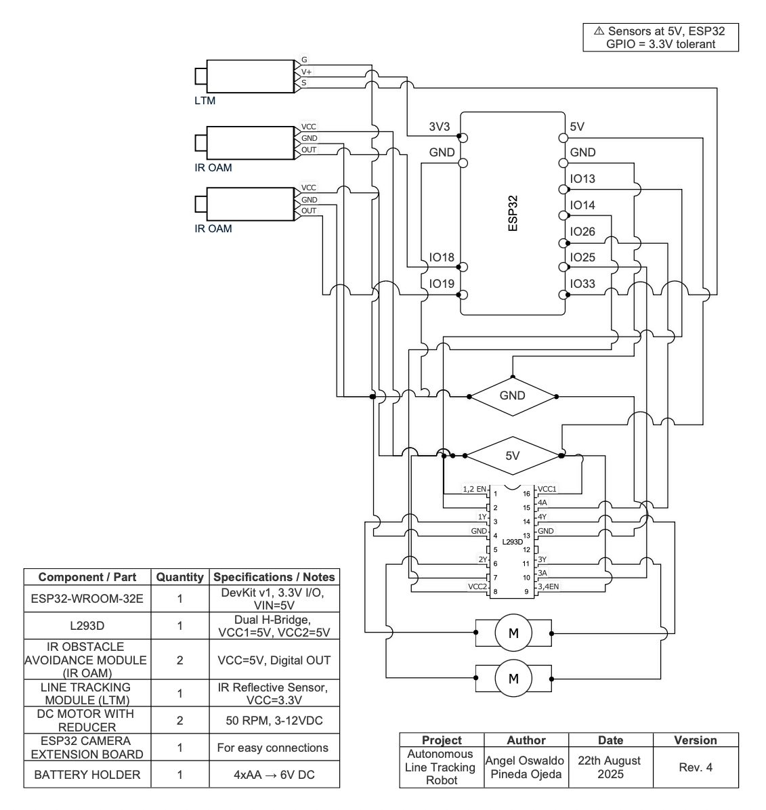

# ESP32-Line-Tracking-Robot

My second robotics projects, where I built a Line Tracking Robot controlled by an ESP32. 
The main challenge: designing and assembling the chassis using only reused or improvised materials, instead of relying on a 3D-printed model or a pre-designed kit.

Demo comming soon...

---

## Components 
 
- ESP32-WROOM-32E
- L293D
- IR Obstacle Avoidance Module (x2)
- Line Tracking Module
- DC Motor with Reducer (x2)
- ESP32 Camera Extension Board
- 4xAA Battery Holder
- Jumper Wires
- Breadboard

---

## How It Works

The robot follows a black line using its IR sensors. Depending on which sensor detecs the line, the ESP32 sends PWM signals through the L293D to control the motors. 

A Finiste State Machine (FSM) defines the possible states (Forward, Left Turn, Right Turn, Search) and transitions based on sensor input. 

FSM explanation + diagram comming soon...

# Challenges and Learnings

- DC Motors: 
The first attempts used regular DC motors without reducers. No matter what, the robot lacked the torque to move properly. I then learned about *gear-reduced motors*, switched to them, and the improvement was immediate. 

- Robot Chassis: 
Iterated with Legos, plastic toys, food containers, cardboard, and even went back to Legos before finally finding a workable solution. In the end, I repurposed parts from a metal toy car, which gave me enough structural pieces to create a stable chassis that could hold everything together securely. 

- Problem Solving: 
Learned to adapt, improvise and iterate when components did not work as expected. To seek solutions and to try and see everything through a different point of view when things did not work out as expected.

---

# Why I Built This

As my second robotics project, I wanted to see how far I could go compared to my first one. 

This Time, I aimed to: 

- Push myself beyond my first robotics build [Smart Traffic Light](https://github.com/pinedaangel20/smart-traffic-light-esp32-lcd-button)
- Explore new components and real-world constraints.
- Improve problem-solving skills by improvising mechanical solutions. 

It was very rewarding to see all the pieces come together after multiple iterations. 

---

*I will soon add pictures of the different chassis prototypes and the final version of the robot*

